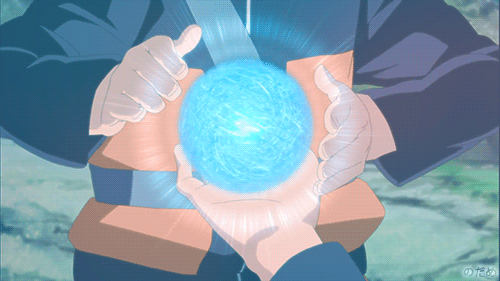

# CHAKRA
🌀 CHAKRA - Real-Time Jutsu Interaction
Chakra is an immersive Creative Coding experience that allows users to perform iconic combat techniques from the Naruto universe using their webcam. By combining computer vision with advanced particle systems, user gestures are translated into dynamic, high-performance 3D visual effects.

 Key Features
Real-Time Hand Tracking: Powered by MediaPipe to detect specific hand signs and spatial coordinates.

Advanced Particle Systems: Rendering over 18,000+ particles simultaneously with Three.js.

Dynamic Mathematical Shapes:

